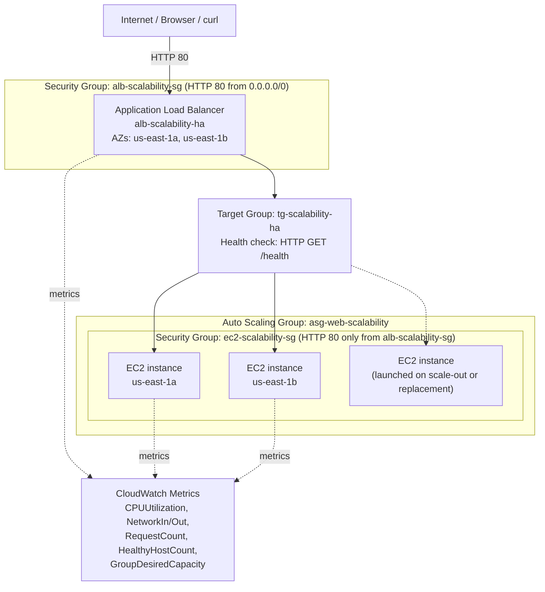

# Scalability, High Availability, and Observability on AWS

Lab for the **Software Architecture** course. It builds an architecture on AWS Academy Learner Lab that integrates three capabilities:

- **Horizontal scalability** (Amazon EC2 Auto Scaling)
- **High availability** (Application Load Balancer + multiple availability zones)
- **Observability** (CloudWatch Metrics)

All the work is done through the AWS console (there is no application code of our own beyond a bootstrap script). This document collects the theory, the decisions made while building the architecture, the answers to the guide's analysis activities, and the final report.

## Author

JUAN SEBASTIÁN GUAYAZÁN CLAVIJO  
Software Architectures (ISIS ARSW - 101)  
Dean's Office of Systems Engineering  
Systems Engineering  
Colombian School of Engineering Julio Garavito  
2026-i

## Initial setup

- **Fixed region:** `us-east-1` (N. Virginia), used throughout the entire lab.
- **VPC:** the account's default VPC is used (`172.31.0.0/16`), which comes with 6 public subnets, one per availability zone in the region (`us-east-1a` through `us-east-1f`). They are public because they share a route table with a route to an Internet Gateway and auto-assign public IPs.

## Core concepts

### Scalability vs. high availability

- **Scalability** is a system's ability to adapt to increasing or decreasing load. It can be **vertical** (more CPU/RAM/disk on a single machine) or **horizontal** (adding more instances). This lab works with horizontal scalability via Auto Scaling.
- **High availability** aims to keep the system running even if a component fails. It's achieved by spreading instances across availability zones and using a Load Balancer that only sends traffic to healthy instances.

These are related but distinct concepts: a system can scale without being highly available (e.g., many instances in a single AZ), and it can be highly available without scaling (two fixed instances in two AZs, with no Auto Scaling).

## Implemented architecture

The AMI used by the Launch Template (`lt-web-scalability`) is built from a base instance (`web-scalability-base`) that runs the bootstrap script in [scripts/user-data.sh](scripts/user-data.sh) once; see [Part 1](#part-1-horizontal-scalability) for why the Launch Template itself doesn't re-run it.

## Part 1: Horizontal scalability

### Security Groups

Two separate Security Groups are created, one for the Load Balancer and one for the EC2 instances, instead of a shared one:

- The ALB's SG (`alb-scalability-sg`) accepts HTTP from the Internet (`0.0.0.0/0`), because it's the architecture's only public entry point.
- The EC2 SG (`ec2-scalability-sg`) accepts HTTP **only from the ALB's SG**, not from `0.0.0.0/0`. This forces all traffic toward the instances to go through the Load Balancer: even if an EC2 instance had a public IP exposed, nobody could reach it directly over HTTP without going through the ALB, reducing the attack surface.

> **Note on names:** the guide suggests the names `sg-alb-scalability` and `sg-ec2-scalability`, but AWS does not allow naming a Security Group starting with the `sg-` prefix (reserved for auto-generated IDs, e.g. `sg-0123abcd...`). `alb-scalability-sg` and `ec2-scalability-sg` were used instead, keeping the same semantic intent.

### Base instance and connectivity troubleshooting

When creating `web-scalability-base` with the `ec2-scalability-sg` Security Group (which only accepts HTTP from the ALB's SG), testing the public IP directly from the browser **doesn't work yet**, because the ALB doesn't exist yet: there is no authorized source to reach the instance over HTTP. The error was `ERR_CONNECTION_TIMED_OUT`, not a connection-refused error.

This illustrates an important Security Group property: they are *stateful* and "fail-closed" (deny by default). When no rule allows the traffic, AWS silently drops the packet instead of responding with an explicit rejection, which the client perceives as a timeout, not a "connection refused." That distinction helps tell a Security Group problem (timeout) apart from an application problem (e.g., "connection refused" if Apache weren't running).

**Solution adopted:** an inbound HTTP rule with source "My IP" was temporarily added to `ec2-scalability-sg`, only to validate the base instance before creating the AMI. This rule is removed once Apache and the `/health` endpoint are confirmed to respond correctly, since it breaks the principle that only the ALB should have direct access.

**Diagnostic technique without SSH:** since the guide deliberately avoids using SSH, to rule out that the problem was the bootstrap script (and not the Security Group) we used **EC2 → Actions → Monitor and troubleshoot → Get system log**, which exposes the console/`cloud-init` output without needing remote access. There we confirmed that `dnf install httpd stress-ng`, `systemctl enable httpd`, and the metadata `curl` calls (token, instance-id, availability-zone) ran without errors, which ruled out an application problem and brought the suspicion back to the Security Group (where, indeed, the temporary rule had been saved with port `0` instead of `80` on the first attempt).

### Creating the AMI

When creating the image (`ami-web-scalability-arsw`) from `web-scalability-base`, the current AWS console no longer uses a **"No reboot"** checkbox (as the guide assumes), but a renamed checkbox with inverted polarity: **"Reboot instance."** Checking it is what tells EC2 to reboot the instance before taking the volume snapshot, to ensure the on-disk data is in a consistent state (no pending write buffers). This checkbox was checked to achieve the same effect the original guide intended (leaving "No reboot" unchecked).

### Launch Template without User Data: known and accepted limitation

The guide explicitly says not to add User Data to the Launch Template, because the AMI already contains Apache installed, enabled, and the static files (`index.html`, `health`, `load.html`) generated on disk.

This has a consequence worth making explicit: `index.html` **is not a dynamic template**, it's a static file that the User Data script generated **once**, substituting `$INSTANCE_ID` and `$AZ` with `web-scalability-base`'s values at the moment it ran. Since the Launch Template doesn't run that script again, **every instance the Auto Scaling Group launches will show the same Instance ID and the same Availability Zone** (the base instance's), even though they are actually distinct instances with different real IDs.

This directly affects two parts of the guide that assume per-instance dynamic content:
- Section 18, which asks to observe responses "from different EC2 instances" by comparing the Instance ID in the HTTP response.
- Section 32 (final challenge), item 5, "Evidence of response from several instances."

**Decision made:** follow the guide as written (no User Data in the Launch Template), instead of adding the script so each instance regenerates its own `index.html` with its real Instance ID. The reason is that this is a learning lab focused on following the Auto Scaling flow step by step as defined by the assignment, not an architecture-redesign exercise. As a consequence, the Instance ID shown in the HTML of every instance will be the same one (the base instance's), even though real traffic balancing between real instances is indeed happening (verifiable through other means: the Target Group itself shows real, distinct instance IDs in its target list, and CloudWatch reports metrics per real instance). This is explained in the final report so it isn't mistaken for a bug.

**Evidence observed (section 18):** the Auto Scaling Group launched two real instances, `i-0132685d075728c82` (us-east-1a) and `i-0e2abd0ca8679538d` (us-east-1b), both registered and `Healthy` in `tg-scalability-ha`. Opening the ALB's DNS (`alb-scalability-ha-2100884508.us-east-1.elb.amazonaws.com`) and reloading several times, the page **always** shows `Instance ID: i-07ec19d59a8544fae` and `Availability Zone: us-east-1a` — `web-scalability-base`'s — confirming the limitation explained above: the content is static and doesn't reflect which of the two real instances responded. The proof that there is real balancing between the two instances is in the Target Group (section 17), where both real IDs appear registered and healthy independently.

The guide's test loop was also run (`for i in {1..10}; do curl -s http://ALB_DNS | grep "Instance ID"; done`) from Git Bash: all 10 requests responded successfully and all 10 showed the same `i-07ec19d59a8544fae`, consistent with what's already explained.

## Activity 1: scalability and high availability analysis

- **Which component distributes traffic?** The Application Load Balancer (`alb-scalability-ha`).
- **Which component decides how many instances should exist?** The Auto Scaling Group (`asg-web-scalability`), based on its desired/minimum/maximum capacity and its scaling policy.
- **Which component checks the health of the instances?** The Target Group (`tg-scalability-ha`), via the health check configured on the `/health` path.
- **Why are two availability zones selected?** So that, if an entire availability zone fails, the instances in the other zone remain available and the service doesn't go down completely.
- **What's the difference between a Target Group and an Auto Scaling Group?** The Target Group is the routing-and-health mechanism: it groups the destinations the ALB sends traffic to and determines whether they're healthy. The Auto Scaling Group is the lifecycle mechanism: it decides how many instances should exist and creates or terminates them. The ASG automatically registers and deregisters its instances in the Target Group, but they are distinct responsibilities.
- **What would happen if an instance fails?** Two sequential steps occur: first the ALB stops sending it traffic as soon as the health check marks it `Unhealthy` (almost immediate, traffic is redirected to the remaining healthy instances); then, the Auto Scaling Group — which uses that same ELB health status — replaces the instance with a new one to restore the desired capacity (this takes longer, on the order of minutes).
- **What would happen if load increases?** The target tracking scaling policy detects that average CPU exceeds the 50% target and the Auto Scaling Group launches additional instances (up to the configured maximum of 3) to spread the load and bring the metric back near the target value.

## Part 3: Scalability test

### EC2 Instance Connect not available on AWS Academy Learner Lab

To generate load with `stress-ng` (Alternative A in section 20), we tried connecting via **EC2 Instance Connect** to one of the Auto Scaling Group's instances (`i-0132685d075728c82`), temporarily adding an SSH rule (port 22, source "My IP") to `ec2-scalability-sg`, following the same pattern used earlier with the base instance.

The connection failed repeatedly with `Error establishing SSH connection to your instance`. The most common causes were ruled out, in order:
1. **Rule not saved:** confirmed it had indeed been saved.
2. **Wrong IP in the rule:** verified with `checkip.amazonaws.com` that the IP exactly matched the rule's CIDR.
3. **Wrong username:** the username field defaulted to `root`, but on Amazon Linux the correct user is `ec2-user` (root doesn't have SSH login enabled). It was fixed and **it still failed**.

With the network, the Security Group, and the username ruled out as causes, the most likely explanation is a **restriction specific to the AWS Academy Learner Lab account**: EC2 Instance Connect requires the account's role to have the `ec2-instance-connect:SendSSHPublicKey` IAM permission, and the Academy role (`voclabs`) usually has trimmed-down permissions. This is consistent with what was already seen in the base instance's system log, where the SSM Agent reported an `AccessDeniedException` for the same class of instance-management permission restriction. Since this is beyond what can be configured from Security Groups or the instance itself, this path was abandoned (and the temporary SSH rule removed) instead of continuing to push on it.

**Decision:** use the guide's Alternative B (HTTP load with `curl` from the local machine) to generate load, accepting the guide's own warning that it might not be enough to cross the CPU threshold and trigger scaling.

### Scaling attempt: real result

First a burst of 500 concurrent requests was run against `/load.html` (`for i in {1..500}; do curl -s ... & done; wait`), then a 5-minute sustained load with continuous bursts of 100 concurrent requests, against the ALB's DNS.

**Result:** the network metrics (`NetworkIn`/`NetworkOut`) show clear spikes, confirming that the requests did reach the real instances. However, `CPUUtilization` stayed practically flat, oscillating between **0.42% and 0.52%** throughout the test — far below the 50% configured as the target in the target-tracking policy. The Auto Scaling Group **did not scale**: capacity stayed at 2 instances during and after the test (confirmed in the ASG's activity history, which only records the initial launch).

**Interpretation:** serving a static HTML file with Apache is such a cheap CPU operation that not even a sustained load of concurrent requests moves it meaningfully. This is direct evidence of the limitation of using only CPU as a scaling metric for a web application: the real bottleneck of an application under load is usually somewhere else (number of connections, available web-server threads/processes, bandwidth, latency), not necessarily CPU.

**Decision made:** accept this result as the "scaling attempt" that lets us document section 32 of the final challenge (which explicitly allows "evidence of scaling **or a scaling attempt**"), instead of chasing the result at all costs by reconfiguring the instances with a traditional SSH key pair just to force it with `stress-ng`. The lesson about the CPU metric's limitation is, in itself, the most valuable outcome of this experiment.

## Activity 2: scaling analysis

- **Which metric triggered the scaling policy?** None. The policy is a target-tracking policy on average `CPUUtilization`, and this metric never exceeded ~0.52% during the test, far below the 50% target, so the policy never triggered.
- **How many instances were there before the test?** 2 (the configured desired/minimum capacity).
- **How many instances were there afterward?** The same 2 — no scaling occurred.
- **How long did the system take to react?** It didn't react: the load was sustained (500 initial concurrent requests + 5 minutes of continuous bursts of 100 requests) and the CPU metric never crossed the threshold that would trigger a scaling decision.
- **What limitation does using only CPU as a scaling metric have?** It doesn't reflect the real bottleneck of many web applications. An application can be serving a lot of real traffic (as seen in `NetworkIn`/`NetworkOut`) without CPU noticing, if the work per request is cheap (like serving a static file). In that case the system would never scale even under real load that could exhaust other resources (concurrent connections, web-server threads/processes, bandwidth).
- **What other metric could be useful for a web application?** `RequestCountPerTarget` (requests per instance) or `TargetResponseTime` (latency), which directly reflect the user experience and the service's real saturation, regardless of whether the bottleneck is CPU. The guide itself mentions "Auto Scaling based on RequestCountPerTarget" in its closing section as a production improvement, precisely for this reason.

## Part 4: Observability with CloudWatch

Note: when filtering metrics in CloudWatch by resource name, metrics from an ALB/Target Group with different names showed up (`alb-ha-web`, `tg-ha-web`), leftovers from another previous lab on the same shared AWS Academy account. We explicitly filtered by `scalability` to isolate only this lab's resource metrics.

## Activity 3: observability analysis

| Metric | AWS Service | Before load | During load | After load | Interpretation | Architectural decision it supports |
|---|---|---|---|---|---|---|
| `CPUUtilization` | Amazon EC2 (per instance, aggregated across the Auto Scaling Group) | ~0.42% | Peak of 0.817% | Back to ~0.4-0.5% | The generated HTTP load (500 + sustained `curl` bursts) wasn't CPU-intensive; serving static content is too cheap to move it | Confirms the limitation of using only CPU as a target metric for this workload; motivates using `RequestCountPerTarget` instead |
| `NetworkIn` / `NetworkOut` | Amazon EC2 | Low baseline (~7k bytes) | Peak of ~296k / ~370k bytes | Back to baseline | Confirms real traffic did reach the instances during the test | Validates that the ALB distributed the requests correctly; the "bottleneck" wasn't connectivity but that traffic not stressing CPU |
| `GroupDesiredCapacity` / in-service instances | EC2 Auto Scaling (group metrics) | 2 | 2 (unchanged) | 2 | The Auto Scaling Group didn't consider scaling necessary, because its only decision signal (average CPU) never crossed the 50% threshold | Supports documenting the result as a "scaling attempt" and recommending a different target metric for production |
| `HealthyHostCount` | ApplicationELB (Target Group) | 2 | 2 | 2 | Both instances stayed healthy throughout the load test, with no service degradation | Confirms the high-availability architecture (ALB + Target Group + 2 AZs) kept working correctly even under the generated load |

## Part 5: High availability test

One of the Auto Scaling Group's two real instances (`i-0132685d075728c82`, in `us-east-1a`) was stopped to simulate a failure. Evidence observed:

- **Target Group:** the stopped instance moved to `Draining` state ("Target deregistration in progress"), while the other two instances (the survivor and a new one) showed as `Healthy`.
- **Auto Scaling Group (Activity History):** two chained events were recorded — *"Terminating EC2 instance: i-0132685d075728c82 — Waiting For ELB Connection Draining"*, caused by *"an EC2 health check indicating it has been terminated or stopped"*; and *"Launching a new EC2 instance: i-06e939b8cdd97a8e1"*, caused by *"an unhealthy instance needing to be replaced."* This confirms it was a **replacement** (keeping desired capacity at 2), not **scaling** (going up to 3).
- **Load Balancer:** reloading `http://alb-scalability-ha-2100884508.us-east-1.elb.amazonaws.com` during and after the process, the service always responded successfully ("Status: Service available"), with no interruptions visible to the user.

## Activity 4: high availability analysis

- **What happened when an instance was stopped?** The Target Group marked it as unhealthy and put it in `Draining`; the Auto Scaling Group terminated it and launched a new instance to restore the desired capacity of 2.
- **Did the Load Balancer keep responding?** Yes, with no errors, at all times.
- **Did the Target Group detect the failure?** Yes, almost immediately via the health check on `/health`.
- **Did the Auto Scaling Group launch a new instance?** Yes, a replacement one (not a scaling one).
- **What's the difference between masking a failure and recovering from a failure?** Masking a failure is the immediate mitigation: the ALB stops sending traffic to the failed instance and redirects it to the healthy ones, so the user never notices the problem, but the broken component stays broken. Recovering from a failure is one step further: actively restoring the original capacity — the Auto Scaling Group terminates the broken component and launches a new one to return to the desired state. Masking hides the symptom; recovering fixes the cause (the lost capacity).
- **What quality attribute does this test demonstrate?** Availability (and, more specifically, fault tolerance / resilience): the system kept working and self-healed from the failure of one of its components, with no manual intervention.

## Relationship between the three concepts

| Concept | Related AWS component | Evidence in the lab |
|---|---|---|
| Scalability | Auto Scaling Group | Automatically creates new instances when load justifies it (CPU target-tracking policy) |
| High availability | ALB + multiple AZs | If an instance goes down, the others (in other availability zones) keep serving traffic without the service being affected |
| Observability | CloudWatch Metrics | `CPUUtilization`, `NetworkIn`/`NetworkOut`, `GroupDesiredCapacity`, and `HealthyHostCount` were reviewed and documented before, during, and after the load test (Activity 3), allowing us to interpret why the system didn't scale |
| Failure detection | Health checks | Periodically check (`/health` path) which instances are healthy and which aren't, letting the Target Group decide who to send traffic to |
| Recovery | Auto Scaling Group | On detecting an unhealthy instance, terminates it and launches a new one to restore the desired capacity (seen in Part 5) |
| Load distribution | Load Balancer | When an instance isn't working, sends all the load to the remaining healthy instances |

## Production improvement proposal

Two improvements chosen, directly anchored to limitations observed in this lab (not generic ones):

1. **Auto Scaling based on `RequestCountPerTarget` instead of CPU.** Directly addresses the problem observed in Part 3: the CPU target-tracking policy never triggered despite real, sustained HTTP traffic, because serving static content is too cheap on CPU. A per-instance request-count metric would reflect the real load perceived by the application, without depending on the bottleneck being CPU specifically.
2. **Infrastructure as Code (IaC).** Addresses the root cause of the limitation documented in Part 1 (Launch Template without User Data): `index.html`'s dynamic content got "frozen" because it was generated once, manually, on the base instance, and baked as-is into the AMI. With a versioned IaC pipeline (Terraform/CloudFormation, or at least a repeatable AMI-building process), each instance's bootstrap would be defined reproducibly and would re-run on every real launch, preventing the dynamic content from depending on a single manual execution.

## Final challenge: technical report

Evidence collected in [evidencias/](evidencias/), organized according to the items requested in section 32 of the guide.

**2. Auto Scaling Group**

`asg-web-scalability` just created, desired capacity 2:

Group metrics (desired capacity, in-service instances) flat at 2 during the load test:

**3. Load Balancer**

ALB configuration (two AZs, SG, HTTP:80 listener → `tg-scalability-ha`):

`alb-scalability-ha` created:

**4. Target Group with Healthy targets**

The ASG's two instances registered and `Healthy`:

**5. Evidence of response from several instances**

The 3 instances (base + 2 from the ASG) running and passing checks:

The ALB's response (limited by the static content documented in Part 1: it always shows the base instance's Instance ID, even though real balancing happens between the ASG's two instances):

**6. Evidence of scaling or a scaling attempt**

The ASG's activity history showing no scaling events during the load test:

Flat CPU despite real traffic, as documented in Part 3:

**7. Evidence of CloudWatch metrics**

Finding that group metrics collection was disabled by default:

ALB/Target Group metrics correctly filtered by resource:

Instance CPU and network during the sustained test:

**8. Evidence of simulated failure and recovery**

Stopped instance in `Draining` state and its `Healthy` replacement:

Activity history showing the termination and replacement:

The ALB keeps responding successfully during the recovery:

**Base setup (Security Groups, instance, AMI, Launch Template)**

Item 1 (architecture diagram) is covered by the [Implemented architecture](#implemented-architecture) section above. Items 9-11 (scalability/high-availability/observability analysis) and 12 (improvement proposal) are covered by the theory sections, Activities 1-4, the concept relationship table, and the improvement proposal in this same README.
