# Escalabilidad, Alta Disponibilidad y Observabilidad en AWS

Laboratorio de la asignatura **Arquitecturas de Software**. Se construye una arquitectura en AWS Academy Learner Lab que integra tres capacidades:

- **Escalabilidad horizontal** (Amazon EC2 Auto Scaling)
- **Alta disponibilidad** (Application Load Balancer + múltiples zonas de disponibilidad)
- **Observabilidad** (CloudWatch Metrics)

Todo el trabajo se realiza sobre la consola de AWS (no hay código de aplicación propio más allá de un script de arranque). Este documento recoge la teoría, las decisiones tomadas durante la construcción, las respuestas a las actividades de análisis de la guía y el informe final.

## Preparación inicial

- **Región fija:** `us-east-1` (N. Virginia), usada durante todo el laboratorio.
- **VPC:** se usa la VPC default de la cuenta (`172.31.0.0/16`), que trae 6 subredes públicas, una por cada zona de disponibilidad de la región (`us-east-1a` a `us-east-1f`). Son públicas porque comparten una tabla de enrutamiento con ruta hacia un Internet Gateway y asignan IP pública automáticamente.

## Conceptos base

### Escalabilidad vs. alta disponibilidad

- **Escalabilidad** es la capacidad de un sistema de adaptarse al aumento o disminución de carga. Puede ser **vertical** (más CPU/RAM/disco en una sola máquina) u **horizontal** (agregar más instancias). Este laboratorio trabaja escalabilidad horizontal con Auto Scaling.
- **Alta disponibilidad** busca que el sistema siga funcionando aunque falle un componente. Se logra distribuyendo instancias entre zonas de disponibilidad y usando un Load Balancer que solo envía tráfico a instancias saludables.

Son conceptos relacionados pero distintos: se puede escalar sin ser altamente disponible (por ejemplo, muchas instancias en una sola AZ) y se puede ser altamente disponible sin escalar (dos instancias fijas en dos AZ, sin Auto Scaling).

## Arquitectura implementada

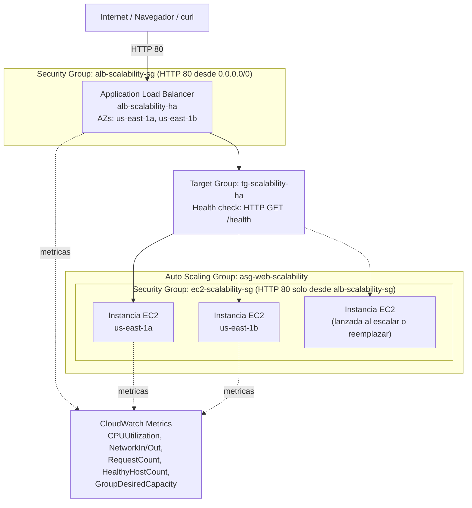
```mermaid
graph TD
    User["Internet / Navegador / curl"]

    subgraph ALBSG["Security Group: alb-scalability-sg (HTTP 80 desde 0.0.0.0/0)"]
        ALB["Application Load Balancer<br/>alb-scalability-ha<br/>AZs: us-east-1a, us-east-1b"]
    end

    TG["Target Group: tg-scalability-ha<br/>Health check: HTTP GET /health"]

    subgraph ASG["Auto Scaling Group: asg-web-scalability<br/>deseada=2 min=2 max=3<br/>Politica de seguimiento de destino: CPU promedio 50%"]
        subgraph EC2SG["Security Group: ec2-scalability-sg (HTTP 80 solo desde alb-scalability-sg)"]
            I1["Instancia EC2<br/>us-east-1a"]
            I2["Instancia EC2<br/>us-east-1b"]
            I3["Instancia EC2<br/>(lanzada al escalar o reemplazar)"]
        end
    end

    CW["CloudWatch Metrics<br/>CPUUtilization, NetworkIn/Out,<br/>RequestCount, HealthyHostCount,<br/>GroupDesiredCapacity"]

    User -->|HTTP 80| ALB
    ALB --> TG
    TG --> I1
    TG --> I2
    TG -.-> I3
    ALB -.metricas.-> CW
    I1 -.metricas.-> CW
    I2 -.metricas.-> CW
```

La AMI que usa el Launch Template (`lt-web-scalability`) se construye a partir de una instancia base (`web-scalability-base`) que corre una sola vez el script de arranque en [scripts/user-data.sh](scripts/user-data.sh); ver la [Parte 1](#parte-1-escalabilidad-horizontal) para entender por qué el propio Launch Template no lo vuelve a ejecutar.

## Parte 1: Escalabilidad horizontal

### Security Groups

Se crean dos Security Groups separados, uno para el Load Balancer y otro para las instancias EC2, en vez de uno compartido:

- El SG del ALB (`alb-scalability-sg`) acepta HTTP desde Internet (`0.0.0.0/0`), porque es el único punto de entrada público de la arquitectura.
- El SG de EC2 (`ec2-scalability-sg`) acepta HTTP **únicamente desde el SG del ALB**, no desde `0.0.0.0/0`. Esto obliga a que todo el tráfico hacia las instancias pase por el Load Balancer: si una instancia EC2 tuviera IP pública expuesta, nadie podría llegarle directo por HTTP sin pasar por el ALB, reduciendo la superficie de ataque.

> **Nota sobre nombres:** la guía sugiere los nombres `sg-alb-scalability` y `sg-ec2-scalability`, pero AWS no permite nombrar un Security Group empezando con el prefijo `sg-` (reservado para los IDs autogenerados, ej. `sg-0123abcd...`). Se usaron en su lugar `alb-scalability-sg` y `ec2-scalability-sg`, manteniendo la misma intención semántica.

### Instancia base y depuración de conectividad

Al crear `web-scalability-base` con el Security Group `ec2-scalability-sg` (que solo acepta HTTP desde el SG del ALB), probar la IP pública directamente desde el navegador **no funciona todavía**, porque el ALB aún no existe: no hay ningún origen autorizado para llegar por HTTP a la instancia. El error fue `ERR_CONNECTION_TIMED_OUT`, no un error de conexión rechazada.

Esto ilustra una propiedad importante de los Security Groups: son *stateful* y de tipo "fail-closed" (denegar por defecto). Cuando no existe una regla que permita el tráfico, AWS descarta el paquete silenciosamente en vez de responder con un rechazo explícito, lo que en el cliente se percibe como un timeout, no como "conexión rechazada". Esa distinción ayuda a diferenciar un problema de Security Group (timeout) de un problema de la aplicación (por ejemplo, "connection refused" si Apache no estuviera corriendo).

**Solución adoptada:** se agregó temporalmente una regla de entrada HTTP con origen "Mi IP" en `ec2-scalability-sg`, solo para validar la instancia base antes de crear la AMI. Esta regla se retira una vez confirmado que Apache y el endpoint `/health` responden correctamente, ya que rompe el principio de que solo el ALB debe tener acceso directo.

**Técnica de diagnóstico sin SSH:** dado que la guía evita deliberadamente el uso de SSH, para descartar que el problema fuera el script de arranque (y no el Security Group) se usó **EC2 → Acciones → Monitorear y solucionar problemas → Obtener registro del sistema**, que expone la salida de consola/`cloud-init` sin necesitar acceso remoto. Ahí se confirmó que `dnf install httpd stress-ng`, `systemctl enable httpd` y los `curl` de metadatos (token, instance-id, availability-zone) se ejecutaron sin errores, lo que descartó un problema de aplicación y devolvió la sospecha al Security Group (donde en efecto la regla temporal se había guardado con el puerto en `0` en vez de `80` en el primer intento).

### Creación de la AMI

Al crear la imagen (`ami-web-scalability-arsw`) desde `web-scalability-base`, la consola actual de AWS ya no usa una casilla **"No reboot"** (como asume la guía), sino una casilla renombrada y con polaridad invertida: **"Reiniciar instancia"**. Marcarla es lo que le indica a EC2 que reinicie la instancia antes de tomar el snapshot de los volúmenes, para asegurar que los datos en disco queden en un estado consistente (sin buffers de escritura pendientes). Se marcó esta casilla para lograr el mismo efecto que buscaba la guía original (dejar "No reboot" desmarcado).

### Launch Template sin User Data: limitación conocida y aceptada

La guía indica explícitamente no agregar User Data en el Launch Template, porque la AMI ya contiene Apache instalado, habilitado, y los archivos estáticos (`index.html`, `health`, `load.html`) generados en el disco.

Esto tiene una consecuencia que vale la pena dejar explícita: `index.html` **no es una plantilla dinámica**, es un archivo estático que el script de User Data generó **una sola vez**, sustituyendo `$INSTANCE_ID` y `$AZ` por los valores de `web-scalability-base` en el momento en que corrió. Como el Launch Template no vuelve a ejecutar ese script, **todas las instancias que lance el Auto Scaling Group mostrarán el mismo Instance ID y la misma Availability Zone** (los de la instancia base), aunque en realidad sean instancias distintas con IDs reales diferentes.

Esto afecta directamente dos partes de la guía que asumen contenido dinámico por instancia:
- Sección 18, que pide observar respuestas "desde diferentes instancias EC2" comparando el Instance ID en la respuesta HTTP.
- Sección 32 (reto final), ítem 5, "Evidencia de respuesta desde varias instancias".

**Decisión tomada:** seguir la guía tal como está (sin User Data en el Launch Template), en vez de agregar el script para que cada instancia regenere su propio `index.html` con su Instance ID real. La razón es que este es un laboratorio de aprendizaje centrado en seguir el flujo de Auto Scaling paso a paso tal como lo define el enunciado, no un ejercicio de rediseño de la arquitectura. Como consecuencia, el Instance ID mostrado en el HTML de todas las instancias será el mismo (el de la instancia base), aunque el balanceo de tráfico entre instancias reales sí esté ocurriendo (verificable por otras vías: el propio Target Group muestra IDs de instancia reales y distintos en su lista de targets, y CloudWatch reporta métricas por instancia real). Esto se explica en el informe final para que no se confunda con un error.

**Evidencia observada (sección 18):** el Auto Scaling Group lanzó dos instancias reales, `i-0132685d075728c82` (us-east-1a) e `i-0e2abd0ca8679538d` (us-east-1b), ambas registradas y `Healthy` en `tg-scalability-ha`. Al abrir el DNS del ALB (`alb-scalability-ha-2100884508.us-east-1.elb.amazonaws.com`) y recargar varias veces, la página **siempre** muestra `Instance ID: i-07ec19d59a8544fae` y `Availability Zone: us-east-1a` — los de `web-scalability-base` — confirmando la limitación explicada arriba: el contenido es estático y no refleja cuál de las dos instancias reales respondió. La prueba de que sí hay balanceo real entre las dos instancias está en el Target Group (sección 17), donde ambos IDs reales aparecen registrados y saludables de forma independiente.

También se ejecutó el bucle de prueba de la guía (`for i in {1..10}; do curl -s http://DNS_DEL_ALB | grep "Instance ID"; done`) desde Git Bash: las 10 peticiones respondieron exitosamente y las 10 mostraron el mismo `i-07ec19d59a8544fae`, consistente con lo ya explicado.

## Actividad 1: análisis de escalabilidad y alta disponibilidad

- **¿Qué componente distribuye el tráfico?** El Application Load Balancer (`alb-scalability-ha`).
- **¿Qué componente decide cuántas instancias deben existir?** El Auto Scaling Group (`asg-web-scalability`), según su capacidad deseada/mínima/máxima y su política de escalamiento.
- **¿Qué componente verifica la salud de las instancias?** El Target Group (`tg-scalability-ha`), mediante el health check configurado en la ruta `/health`.
- **¿Por qué se seleccionan dos zonas de disponibilidad?** Para que, si una zona de disponibilidad completa falla, las instancias de la otra zona sigan disponibles y el servicio no se caiga por completo.
- **¿Qué diferencia existe entre Target Group y Auto Scaling Group?** El Target Group es el mecanismo de enrutamiento y salud: agrupa los destinos hacia donde el ALB envía tráfico y determina si están saludables. El Auto Scaling Group es el mecanismo de ciclo de vida: decide cuántas instancias deben existir y las crea o termina. El ASG registra y retira automáticamente sus instancias en el Target Group, pero son responsabilidades distintas.
- **¿Qué pasaría si una instancia falla?** Ocurren dos pasos secuenciales: primero el ALB deja de enviarle tráfico en cuanto el health check la marca `Unhealthy` (casi inmediato, el tráfico se redirige a las instancias sanas restantes); después, el Auto Scaling Group —que usa ese mismo estado de salud del ELB— reemplaza la instancia por una nueva para recuperar la capacidad deseada (esto tarda más, del orden de minutos).
- **¿Qué pasaría si aumenta la carga?** La política de target tracking scaling detecta que la CPU promedio supera el 50% objetivo y el Auto Scaling Group lanza instancias adicionales (hasta el máximo configurado de 3) para repartir la carga y devolver la métrica cerca del valor objetivo.

## Parte 3: Prueba de escalabilidad

### EC2 Instance Connect no disponible en AWS Academy Learner Lab

Para generar carga con `stress-ng` (Alternativa A de la sección 20) se intentó conectar por **EC2 Instance Connect** a una de las instancias del Auto Scaling Group (`i-0132685d075728c82`), agregando temporalmente una regla SSH (puerto 22, origen "Mi IP") en `ec2-scalability-sg`, siguiendo el mismo patrón usado antes con la instancia base.

La conexión falló repetidamente con `Error establishing SSH connection to your instance`. Se descartaron, en orden, las causas más comunes:
1. **Regla no guardada:** se confirmó que sí se guardó.
2. **IP incorrecta en la regla:** se verificó con `checkip.amazonaws.com` que la IP coincidía exactamente con el CIDR de la regla.
3. **Usuario incorrecto:** el campo de usuario traía `root` por defecto, pero en Amazon Linux el usuario correcto es `ec2-user` (root no tiene login SSH habilitado). Se corrigió y **igual falló**.

Con la red, el Security Group y el usuario descartados como causa, la explicación más probable es una **restricción propia de la cuenta de AWS Academy Learner Lab**: EC2 Instance Connect requiere que el rol de la cuenta tenga el permiso IAM `ec2-instance-connect:SendSSHPublicKey`, y el rol de Academy (`voclabs`) suele tener permisos recortados. Esto es consistente con lo ya visto en el log del sistema de la instancia base, donde el SSM Agent reportaba `AccessDeniedException` por la misma clase de restricción de permisos de gestión de instancias. Como esto excede lo que se puede configurar desde Security Groups o la instancia misma, se abandonó esta vía (y se retiró la regla SSH temporal) en vez de seguir insistiendo.

**Decisión:** usar la Alternativa B de la guía (carga HTTP con `curl` desde el propio equipo) para generar la carga, asumiendo la advertencia de la guía de que podría no ser suficiente para superar el umbral de CPU y disparar el escalamiento.

### Intento de escalamiento: resultado real

Se ejecutó primero una ráfaga de 500 peticiones concurrentes contra `/load.html` (`for i in {1..500}; do curl -s ... & done; wait`), y luego una carga sostenida de 5 minutos con ráfagas continuas de 100 peticiones concurrentes, contra el DNS del ALB.

**Resultado:** las métricas de red (`NetworkIn`/`NetworkOut`) muestran picos claros, confirmando que las peticiones sí llegaron a las instancias reales. Sin embargo, `CPUUtilization` se mantuvo prácticamente plana, oscilando entre **0.42% y 0.52%** durante toda la prueba — muy lejos del 50% configurado como objetivo en la política de target tracking. El Auto Scaling Group **no escaló**: la capacidad se mantuvo en 2 instancias durante y después de la prueba (confirmado en el historial de actividad del ASG, que solo registra el lanzamiento inicial).

**Interpretación:** servir un archivo HTML estático con Apache es una operación tan barata en CPU que ni siquiera una carga sostenida de peticiones concurrentes la mueve de forma significativa. Esto es evidencia directa de la limitación de usar únicamente CPU como métrica de escalamiento para una aplicación web: el cuello de botella real de una aplicación bajo carga suele estar en otro lado (número de conexiones, hilos/procesos disponibles del servidor web, ancho de banda, latencia), no necesariamente en CPU.

**Decisión tomada:** aceptar este resultado como el "intento de escalamiento" que permite documentar la sección 32 del reto final (que explícitamente admite "evidencia de escalamiento **o intento de escalamiento**"), en vez de perseguir el resultado a toda costa reconfigurando las instancias con un par de claves SSH tradicional solo para forzarlo con `stress-ng`. El aprendizaje sobre la limitación de la métrica CPU es, en sí mismo, el resultado más valioso de este experimento.

## Actividad 2: análisis del escalamiento

- **¿Qué métrica activó la política de escalamiento?** Ninguna. La política es de tipo target tracking sobre `CPUUtilization` promedio, y esta métrica nunca superó ~0.52% durante la prueba, muy lejos del 50% objetivo, así que la política nunca se activó.
- **¿Cuántas instancias había antes de la prueba?** 2 (la capacidad deseada/mínima configurada).
- **¿Cuántas instancias hubo después?** Las mismas 2 — no hubo escalamiento.
- **¿Cuánto tiempo tardó el sistema en reaccionar?** No reaccionó: se sostuvo la carga (500 peticiones concurrentes iniciales + 5 minutos de ráfagas continuas de 100 peticiones) y la métrica de CPU nunca cruzó el umbral que dispararía una decisión de escalamiento.
- **¿Qué limitación tiene usar solo CPU como métrica de escalamiento?** Que no refleja el cuello de botella real de muchas aplicaciones web. Una aplicación puede estar sirviendo mucho tráfico real (como se vio en `NetworkIn`/`NetworkOut`) sin que la CPU se entere, si el trabajo por petición es barato (como servir un archivo estático). En ese caso el sistema nunca escalaría aunque estuviera bajo una carga real que sí podría agotar otros recursos (conexiones concurrentes, procesos/hilos del servidor web, ancho de banda).
- **¿Qué otra métrica podría ser útil para una aplicación web?** `RequestCountPerTarget` (peticiones por instancia) o `TargetResponseTime` (latencia), que reflejan directamente la experiencia del usuario y la saturación real del servicio, independientemente de si el cuello de botella es CPU. La propia guía menciona en su cierre "Auto Scaling basado en RequestCountPerTarget" como mejora para producción, justamente por esta razón.

## Parte 4: Observabilidad con CloudWatch

Nota: al filtrar métricas en CloudWatch por nombre de recurso, aparecieron métricas de un ALB/Target Group con nombres distintos (`alb-ha-web`, `tg-ha-web`), residuo de otro laboratorio previo en la misma cuenta compartida de AWS Academy. Se filtró explícitamente por `scalability` para aislar solo las métricas de los recursos de este laboratorio.

## Actividad 3: análisis de observabilidad

| Métrica | Servicio AWS | Antes de la carga | Durante la carga | Después de la carga | Interpretación | Decisión arquitectónica que soporta |
|---|---|---|---|---|---|---|
| `CPUUtilization` | Amazon EC2 (por instancia, agregado en el Auto Scaling Group) | ~0.42% | Pico de 0.817% | Vuelve a ~0.4-0.5% | La carga HTTP generada (500 + ráfagas sostenidas de `curl`) no fue intensiva en CPU; servir contenido estático es demasiado barato para moverla | Confirma la limitación de usar solo CPU como métrica de destino para esta carga de trabajo; motiva usar `RequestCountPerTarget` en su lugar |
| `NetworkIn` / `NetworkOut` | Amazon EC2 | Base baja (~7k bytes) | Pico de ~296k / ~370k bytes | Vuelve a la base | Confirma que sí hubo tráfico real llegando a las instancias durante la prueba | Valida que el ALB distribuyó las solicitudes correctamente; el "cuello de botella" no fue de conectividad sino de que ese tráfico no estresó CPU |
| `GroupDesiredCapacity` / instancias en servicio | EC2 Auto Scaling (métricas de grupo) | 2 | 2 (sin cambio) | 2 | El Auto Scaling Group no consideró necesario escalar, porque su única señal de decisión (CPU promedio) nunca cruzó el umbral del 50% | Soporta documentar el resultado como "intento de escalamiento" y recomendar otra métrica de destino para producción |
| `HealthyHostCount` | ApplicationELB (Target Group) | 2 | 2 | 2 | Ambas instancias se mantuvieron saludables durante toda la prueba de carga, sin degradación del servicio | Confirma que la arquitectura de alta disponibilidad (ALB + Target Group + 2 AZ) siguió funcionando correctamente incluso bajo la carga generada |

## Parte 5: Prueba de alta disponibilidad

Se detuvo una de las dos instancias reales del Auto Scaling Group (`i-0132685d075728c82`, en `us-east-1a`) para simular una falla. Evidencia observada:

- **Target Group:** la instancia detenida pasó a estado `Draining` ("Target deregistration in progress"), mientras las otras dos instancias (la sobreviviente y una nueva) aparecían `Healthy`.
- **Auto Scaling Group (Historial de actividad):** se registraron dos eventos encadenados — *"Terminating EC2 instance: i-0132685d075728c82 — Waiting For ELB Connection Draining"*, causado por *"an EC2 health check indicating it has been terminated or stopped"*; y *"Launching a new EC2 instance: i-06e939b8cdd97a8e1"*, causado por *"an unhealthy instance needing to be replaced"*. Esto confirma que fue un **reemplazo** (mantener capacidad deseada en 2), no un **escalamiento** (subir a 3).
- **Load Balancer:** al recargar `http://alb-scalability-ha-2100884508.us-east-1.elb.amazonaws.com` durante y después del proceso, el servicio respondió siempre con éxito ("Estado: Servicio disponible"), sin interrupciones visibles para el usuario.

## Actividad 4: análisis de alta disponibilidad

- **¿Qué ocurrió cuando se detuvo una instancia?** El Target Group la marcó como no saludable y la puso en `Draining`; el Auto Scaling Group la terminó y lanzó una instancia nueva para recuperar la capacidad deseada de 2.
- **¿El Load Balancer siguió respondiendo?** Sí, sin errores, en todo momento.
- **¿El Target Group detectó la falla?** Sí, casi inmediatamente vía el health check en `/health`.
- **¿El Auto Scaling Group lanzó una nueva instancia?** Sí, una de reemplazo (no de escalamiento).
- **¿Qué diferencia existe entre ocultar una falla y recuperarse de una falla?** Ocultar (enmascarar) una falla es la mitigación inmediata: el ALB deja de enviarle tráfico a la instancia caída y lo redirige a las instancias sanas, así el usuario nunca nota el problema, pero el componente roto sigue roto. Recuperarse de una falla es un paso adicional: restaurar activamente la capacidad original — el Auto Scaling Group termina el componente roto y lanza uno nuevo para volver al estado deseado. Enmascarar oculta el síntoma; recuperarse corrige la causa (la pérdida de capacidad).
- **¿Qué atributo de calidad se evidencia en esta prueba?** Disponibilidad (y, más específicamente, tolerancia a fallos / resiliencia): el sistema siguió funcionando y se autorreparó ante la falla de uno de sus componentes, sin intervención manual.

## Relación entre los tres conceptos

| Concepto | Componente AWS relacionado | Evidencia en el laboratorio |
|---|---|---|
| Escalabilidad | Auto Scaling Group | Permite crear instancias nuevas automáticamente cuando la carga lo justifica (política de target tracking por CPU) |
| Alta disponibilidad | ALB + múltiples AZ | Si una instancia se cae, las demás (en otras zonas de disponibilidad) siguen atendiendo tráfico sin que el servicio se vea afectado |
| Observabilidad | CloudWatch Metrics | Se revisaron y documentaron `CPUUtilization`, `NetworkIn`/`NetworkOut`, `GroupDesiredCapacity` y `HealthyHostCount` antes, durante y después de la prueba de carga (Actividad 3), permitiendo interpretar por qué el sistema no escaló |
| Detección de fallos | Health checks | Verifican periódicamente (ruta `/health`) cuáles instancias están sanas y cuáles no, y así el Target Group decide a quién enviarle tráfico |
| Recuperación | Auto Scaling Group | Al detectar una instancia no saludable, la termina y lanza una nueva para restaurar la capacidad deseada (visto en la Parte 5) |
| Distribución de carga | Load Balancer | Cuando una instancia no está funcionando, dirige toda la carga a las instancias restantes que sí están saludables |

## Propuesta de mejora para producción

Dos mejoras elegidas, ancladas directamente a limitaciones observadas en este laboratorio (no genéricas):

1. **Auto Scaling basado en `RequestCountPerTarget` en vez de CPU.** Ataca directamente el problema observado en la Parte 3: la política de target tracking por CPU nunca se activó pese a tráfico HTTP real y sostenido, porque servir contenido estático es demasiado barato en CPU. Una métrica de peticiones por instancia reflejaría la carga real percibida por la aplicación, sin depender de que el cuello de botella sea justamente CPU.
2. **Infraestructura como código (IaC).** Ataca la causa raíz de la limitación documentada en la Parte 1 (Launch Template sin User Data): el contenido dinámico de `index.html` quedó "congelado" porque se generó una sola vez, manualmente, en la instancia base, y se horneó tal cual en la AMI. Con un pipeline de IaC versionado (Terraform/CloudFormation, o al menos un proceso repetible de construcción de AMIs), el bootstrap de cada instancia se definiría de forma reproducible y se re-ejecutaría en cada lanzamiento real, evitando que el contenido dinámico dependa de una única ejecución manual.

## Reto final: informe técnico

Evidencia recopilada en [evidencias/](evidencias/), organizada según los puntos pedidos en la sección 32 de la guía.

**2. Auto Scaling Group**

`asg-web-scalability` recién creado, capacidad deseada 2:

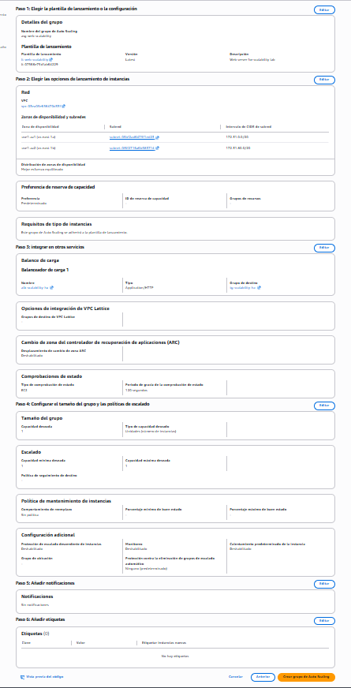

Métricas del grupo (capacidad deseada, instancias en servicio) planas en 2 durante la prueba de carga:

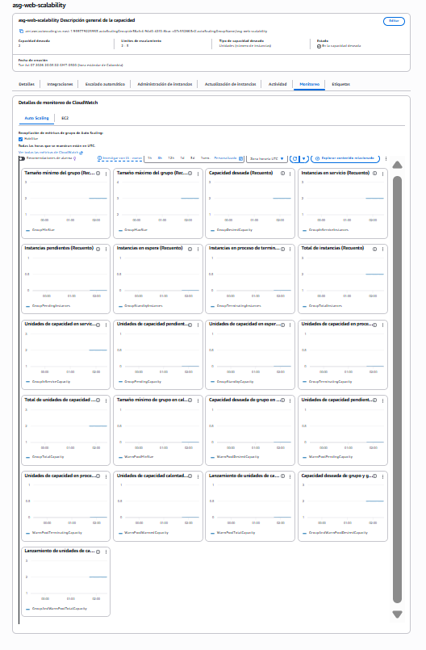

**3. Load Balancer**

Configuración del ALB (dos AZ, SG, listener HTTP:80 → `tg-scalability-ha`):

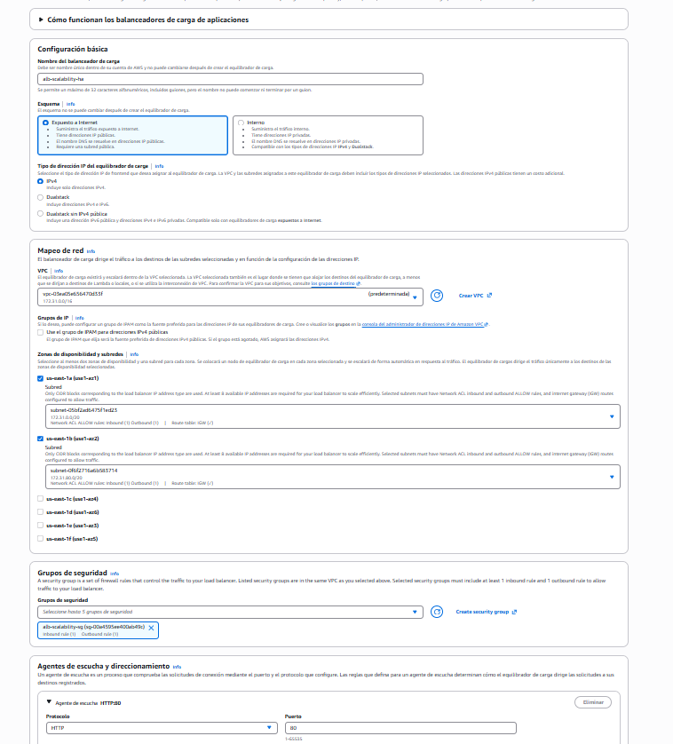
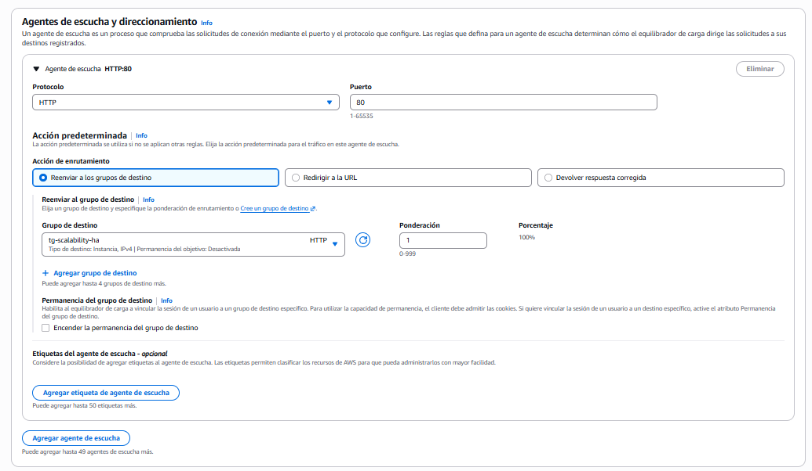

`alb-scalability-ha` creado:

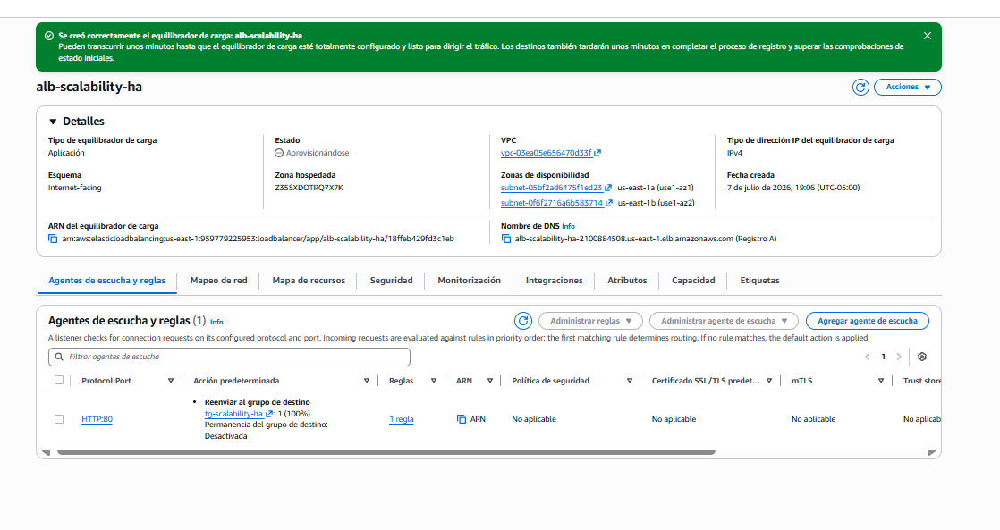

**4. Target Group con targets Healthy**

Las dos instancias del ASG registradas y `Healthy`:

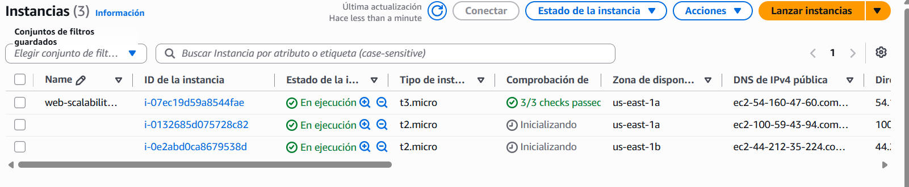

**5. Evidencia de respuesta desde varias instancias**

Las 3 instancias (base + 2 del ASG) corriendo y con checks pasados:

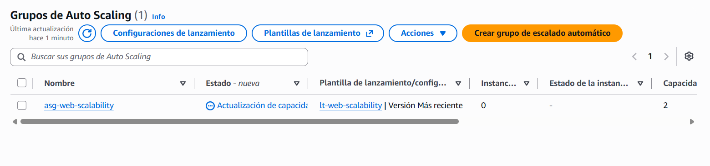

Respuesta del ALB (limitada por el contenido estático documentado en la Parte 1: siempre muestra el Instance ID de la instancia base, aunque el balanceo real ocurre entre las dos instancias del ASG):

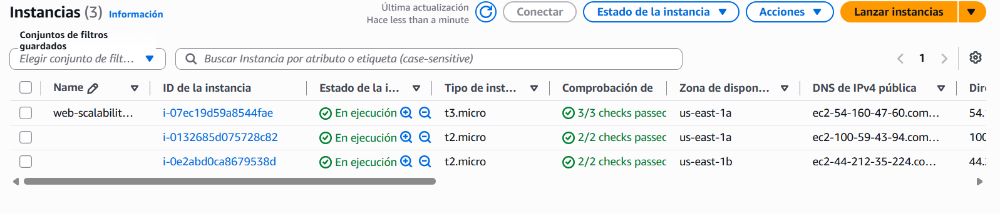
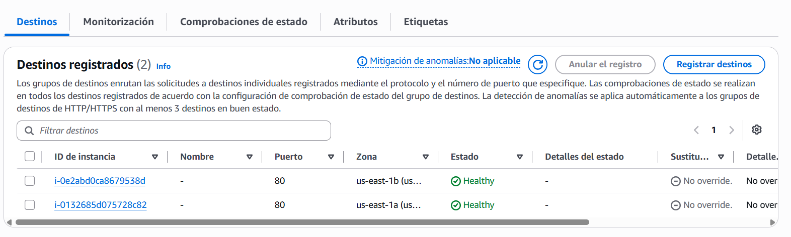

**6. Evidencia de escalamiento o intento de escalamiento**

Historial de actividad del ASG mostrando que no hubo eventos de escalamiento durante la prueba de carga:

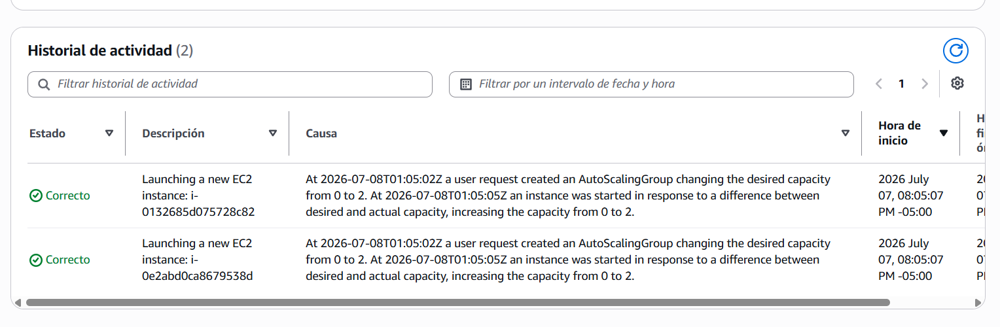

CPU plana pese al tráfico real, según lo documentado en la Parte 3:

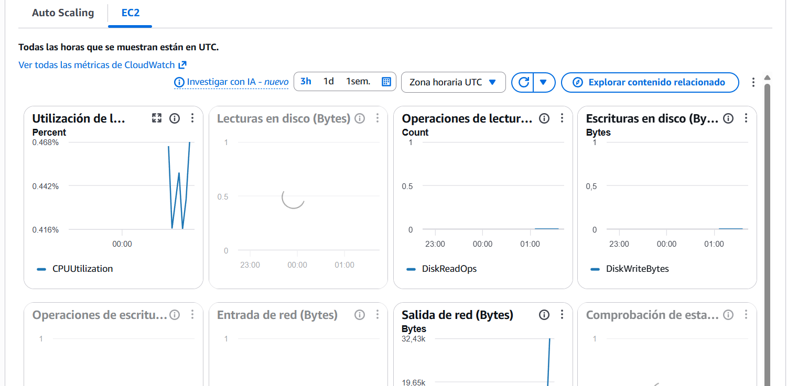
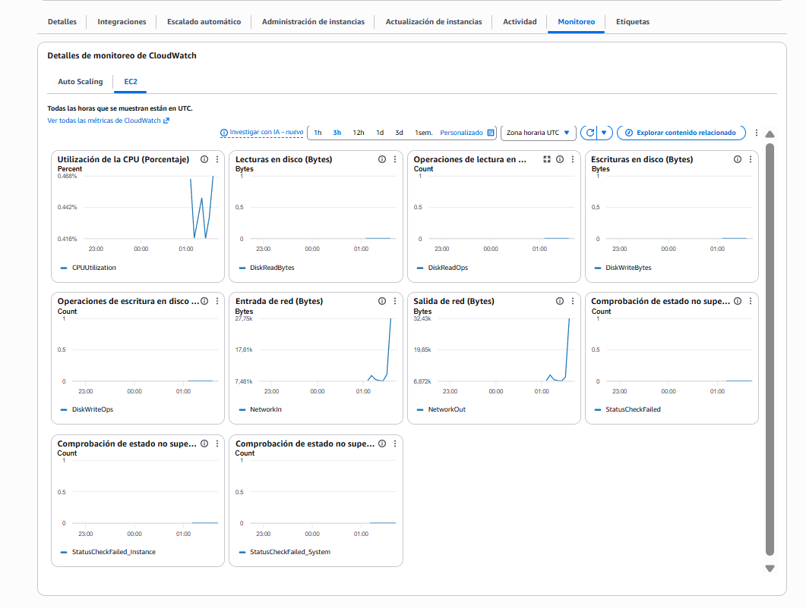

**7. Evidencia de métricas en CloudWatch**

Hallazgo de que la recolección de métricas de grupo estaba deshabilitada por defecto:

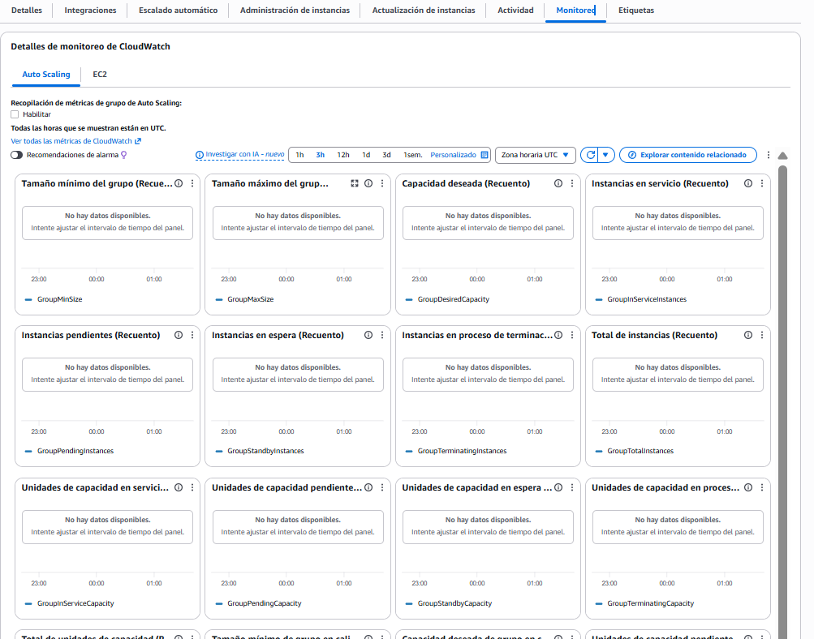

Métricas del ALB/Target Group correctamente filtradas por recurso:

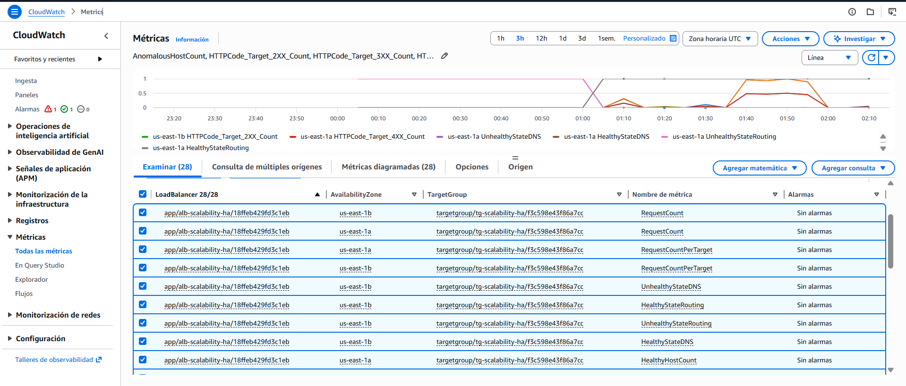

CPU y red de las instancias durante la prueba sostenida:

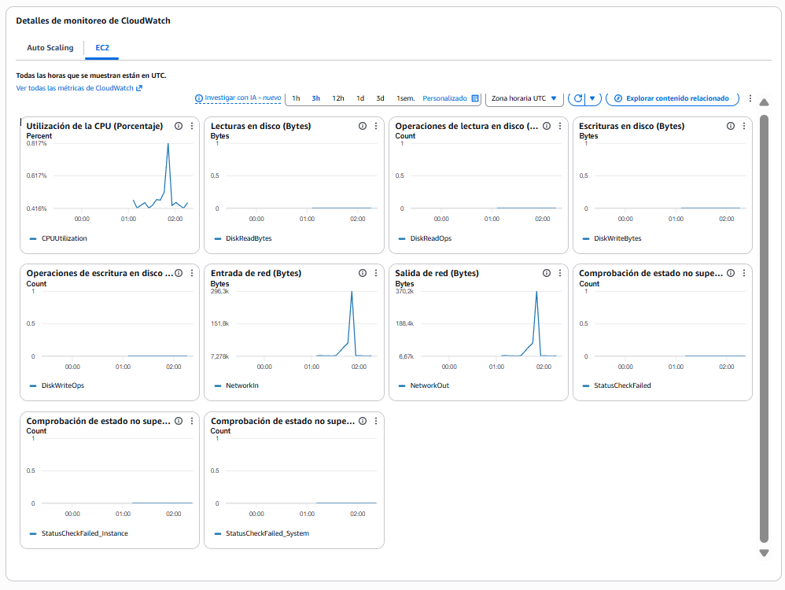

**8. Evidencia de falla simulada y recuperación**

Instancia detenida en estado `Draining` y su reemplazo `Healthy`:

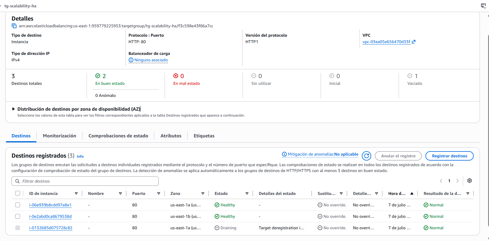

Historial de actividad mostrando la terminación y el reemplazo:

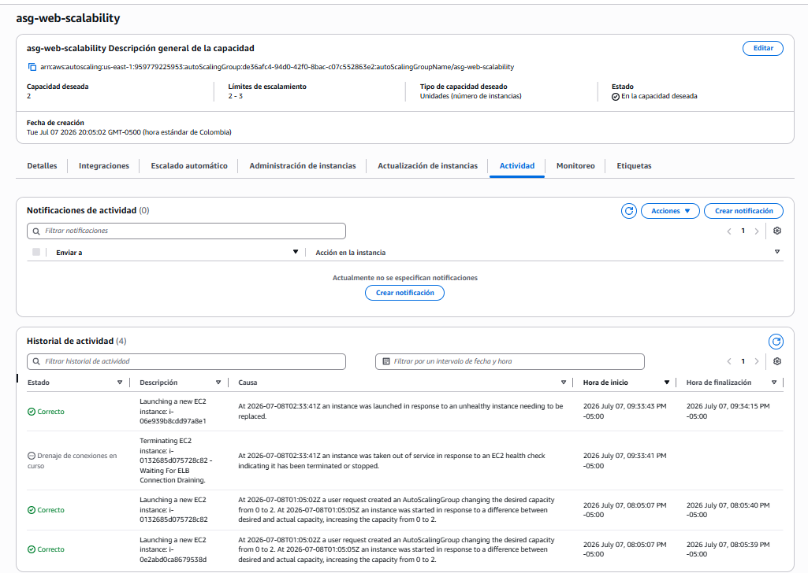

El ALB sigue respondiendo con éxito durante la recuperación:

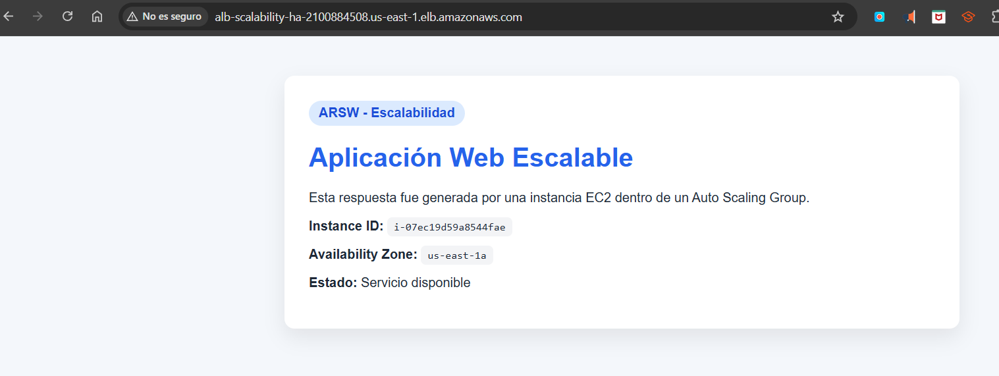

**Configuración base (Security Groups, instancia, AMI, Launch Template)**

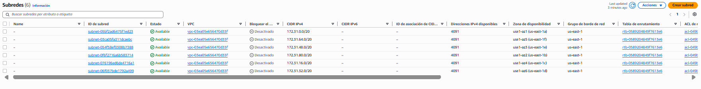
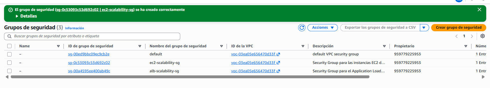
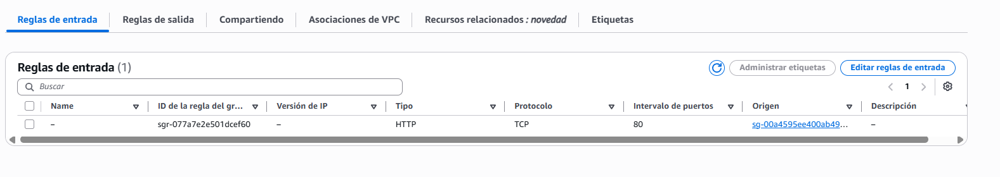
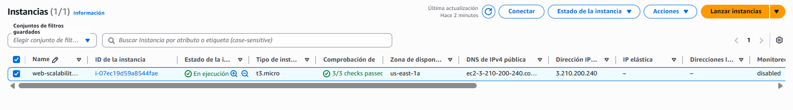

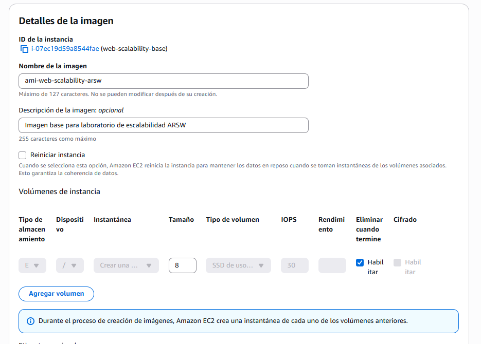
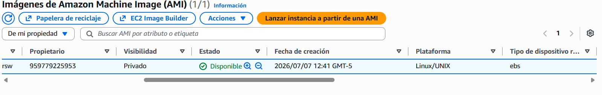

El punto 1 (diagrama de arquitectura) está cubierto por la sección [Arquitectura implementada](#arquitectura-implementada) más arriba. Los puntos 9-11 (análisis de escalabilidad/alta disponibilidad/observabilidad) y 12 (propuesta de mejora) están cubiertos por las secciones de teoría, las Actividades 1-4, la tabla de relación de conceptos, y la propuesta de mejora de este mismo README.
